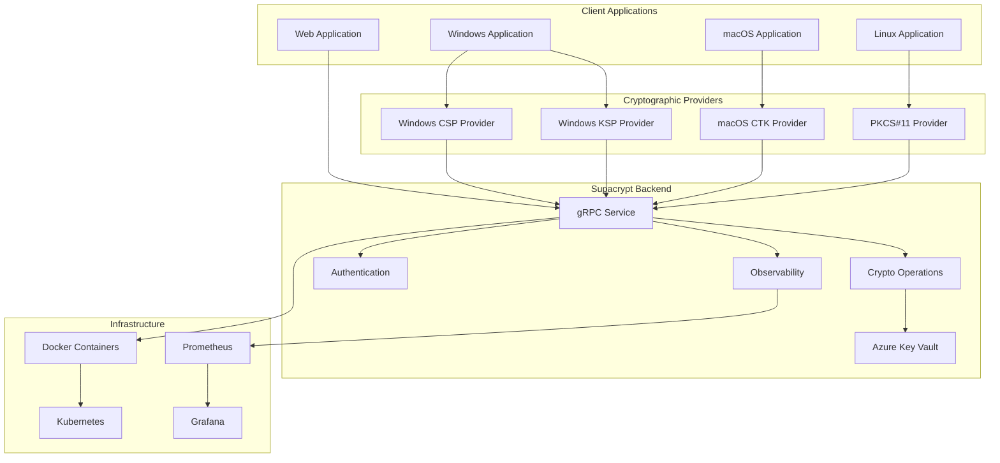
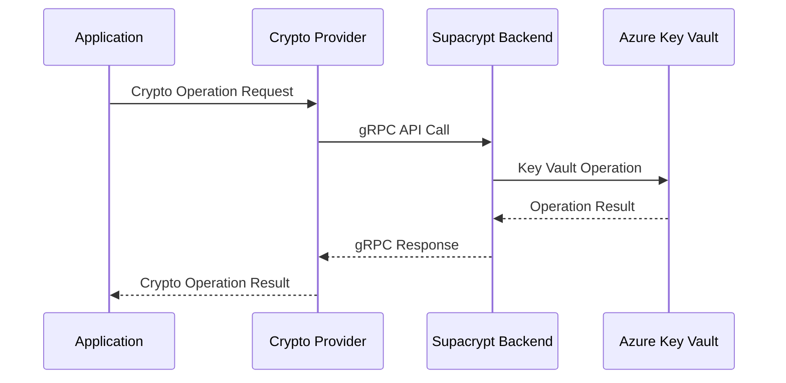
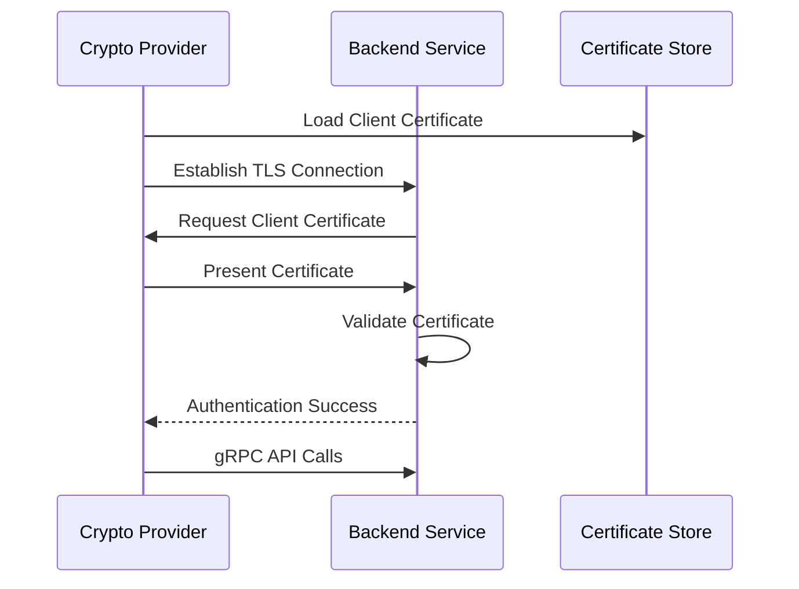
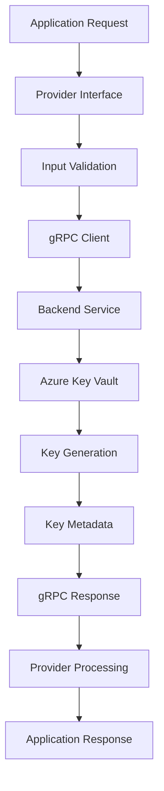
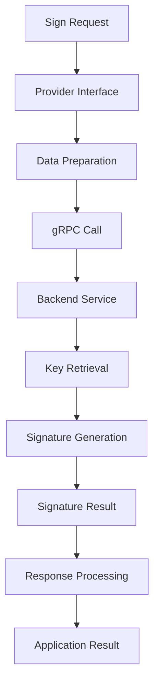
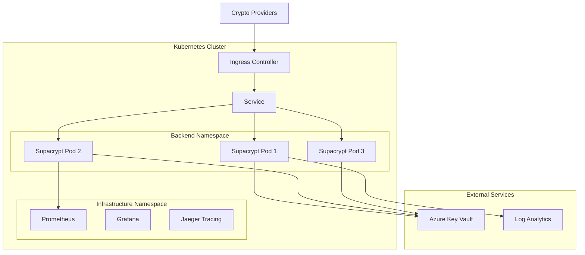
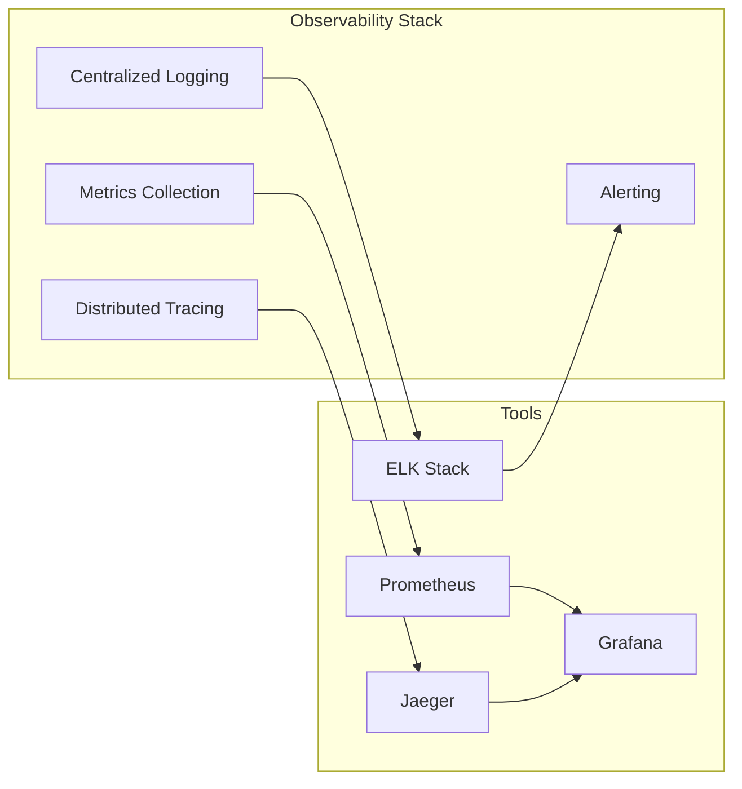

# Supacrypt System Architecture

## Executive Summary

Supacrypt is a comprehensive cryptographic suite that provides unified cryptographic services across multiple platforms through a centralized backend service and platform-specific cryptographic providers. The architecture enables applications to perform cryptographic operations transparently across Windows, macOS, and Linux platforms while maintaining strong security and performance characteristics.

## High-Level Architecture

## Component Overview

### 1. Backend Service (Production Ready - 85% Complete)
The core service providing centralized cryptographic operations.

**Key Features:**
- gRPC API for all cryptographic operations
- Azure Key Vault integration for secure key management
- Client certificate authentication
- Comprehensive observability (metrics, tracing, logging)
- Docker and Kubernetes deployment ready

**Implementation Status:** Production ready with enterprise features

### 2. PKCS#11 Provider (Beta Ready - 75% Complete)
Cross-platform cryptographic provider implementing PKCS#11 v2.40 standard.

**Key Features:**
- Full PKCS#11 v2.40 interface compliance
- Cross-platform support (Linux, macOS, Windows)
- gRPC backend integration
- Session and object management
- Comprehensive error handling

**Implementation Status:** Well-advanced, ready for beta testing

### 3. Platform-Specific Providers

#### macOS CTK Provider (Beta Ready - 70% Complete)
Native macOS CryptoTokenKit implementation.

**Key Features:**
- CryptoTokenKit framework integration
- Universal Binary (Intel + Apple Silicon)
- macOS Keychain integration
- Swift-based implementation
- System-level token recognition

**Implementation Status:** Good foundation, ready for limited testing

#### Windows CSP Provider (Development - 60% Complete)
Native Windows CAPI Cryptographic Service Provider.

**Key Features:**
- Windows CAPI integration
- Provider registration and discovery
- Windows-specific cryptographic operations
- Registry configuration

**Implementation Status:** Moderate implementation, needs completion work

#### Windows KSP Provider (Development - 65% Complete)  
Native Windows CNG Key Storage Provider.

**Key Features:**
- Windows CNG integration
- Modern cryptographic algorithms
- Key storage and management
- CNG compliance

**Implementation Status:** Moderate implementation, needs completion work

## Architectural Patterns

### 1. Backend-as-a-Service Pattern
All cryptographic operations are centralized in the backend service, providing:
- Consistent cryptographic implementations
- Centralized key management
- Unified security policies
- Simplified maintenance and updates

### 2. Provider Abstraction Pattern
Platform-specific providers implement standard interfaces:
- PKCS#11 for cross-platform compatibility
- CSP/KSP for Windows native integration
- CTK for macOS native integration
- Common backend communication protocol

### 3. Microservices Architecture
The backend service follows microservices principles:
- Single responsibility (cryptographic operations)
- Independent deployment and scaling
- API-first design with gRPC
- Container-native deployment

### 4. Security-First Design
Security is integrated at every architectural level:
- mTLS for all communications
- Client certificate authentication
- Secure key storage with Azure Key Vault
- Comprehensive audit logging
- Input validation and sanitization

## Communication Architecture

### gRPC API Design
All components communicate through a well-defined gRPC API:

### Authentication Flow
Client certificate authentication ensures secure communication:

## Data Flow Architecture

### Key Generation Flow

### Signature Operation Flow

## Deployment Architecture

### Container-Native Design
The system is designed for modern container deployments:

### High Availability Design
The architecture supports high availability through:
- Multiple backend service replicas
- Load balancing across instances
- Circuit breaker patterns for resilience
- Health checks and auto-recovery
- Persistent storage for key metadata

## Security Architecture Integration

### Defense in Depth
Multiple security layers protect the system:

1. **Network Security**: TLS encryption for all communications
2. **Authentication**: Client certificate-based authentication
3. **Authorization**: Role-based access control
4. **Data Protection**: Secure key storage in Azure Key Vault
5. **Audit Logging**: Comprehensive operation logging
6. **Input Validation**: Strict input validation and sanitization

### Trust Boundaries
Clear trust boundaries are established:
- Application ↔ Provider: Standard cryptographic interfaces
- Provider ↔ Backend: Authenticated gRPC with mTLS
- Backend ↔ Key Vault: Azure AD authentication and network isolation

## Performance Architecture

### Optimization Strategies
The architecture includes several performance optimizations:

1. **Connection Pooling**: Reuse gRPC connections for efficiency
2. **Caching**: Strategic caching of key metadata and session data
3. **Asynchronous Operations**: Non-blocking I/O for high throughput
4. **Load Balancing**: Distribute operations across backend instances
5. **Circuit Breakers**: Fast failure handling to prevent cascading issues

### Performance Targets
- **Latency**: <2000ms for cryptographic operations
- **Throughput**: >1000 operations/second
- **Availability**: 99.9% uptime
- **Overhead**: <5% system resource overhead

## Observability Architecture

### Monitoring Stack
Comprehensive observability through:

### Key Metrics
- Operation latency and throughput
- Error rates and types
- Resource utilization
- Security events and authentication failures
- Backend service health and availability

## Evolution and Extensibility

### Future Architecture Considerations
The architecture is designed to support future enhancements:

1. **Additional Providers**: New platform-specific providers can be easily integrated
2. **Multi-Backend Support**: Support for multiple cryptographic backends
3. **Federation**: Cross-organization cryptographic services
4. **Cloud Provider Flexibility**: Support for AWS KMS, Google Cloud KMS
5. **Advanced Algorithms**: Post-quantum cryptography integration

### Migration Paths
The modular architecture supports incremental migration:
- Component-by-component deployment
- Gradual rollout with feature flags
- Backward compatibility maintenance
- Zero-downtime deployment capabilities

## Implementation Status Summary

| Component | Architecture | Implementation | Status |
|-----------|--------------|----------------|---------|
| Backend Service | ✅ Complete | 85% Complete | Production Ready |
| PKCS#11 Provider | ✅ Complete | 75% Complete | Beta Ready |
| CTK Provider | ✅ Complete | 70% Complete | Beta Ready |
| CSP Provider | ✅ Complete | 60% Complete | Needs Work |
| KSP Provider | ✅ Complete | 65% Complete | Needs Work |
| Infrastructure | ✅ Complete | 90% Complete | Production Ready |

## Next Steps

### Immediate Priorities
1. **Deploy Production Backend**: The backend service is ready for production deployment
2. **Beta Test PKCS#11**: Begin application integration testing
3. **Complete Windows Providers**: Finish CSP and KSP implementation

### Long-term Objectives
1. **Full Multi-Platform Support**: Complete all provider implementations
2. **Performance Optimization**: Fine-tune system performance
3. **Advanced Features**: Implement additional cryptographic capabilities
4. **Compliance Certification**: Pursue formal security certifications

This architecture provides a solid foundation for a comprehensive, secure, and scalable cryptographic service platform with clear paths for completion and future enhancement.